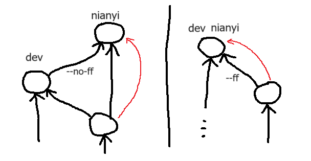
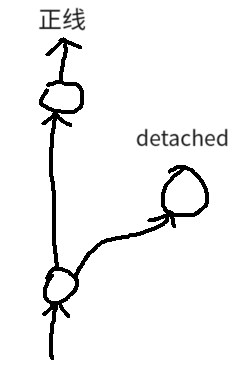

# Git 仓库管理


## 常驻分支

本项目有两个常驻分支（branch）：`master` 和 `dev`。

### `master`

`master` 是主分支，用以记录阶段性发布的稳定版本。
`master` 上的 commit 通常不与程序上的具体功能相绑定，而只与内容有关。
例如，搭建了一个新谜题或者展示关卡，可以发布到 `master` 上。
但偶尔完成了比较重要的程序模块，也可以破例在 `master` 上单独创建 commit。

`master` 开启了分支保护，其必须通过在 GitHub 上发起 pull request 才能 merge。
要 merge 到 `master`，不应采用 fast-forward 或 rebase 的方式；
必须创建显式的 non-fast-forward 多祖先 commit，其直接祖先是 `master` 的上一个 commit。
`master` 上的 commit 绝对不应当被撤回，创建之前请先通知其他协作开发者。

## `dev`

`dev` 是公共的迭代分支，仅比 `master` 次一级。
`dev` 上的 commit 应当是语义稳定的，协作开发者总可以放心使用此分支上的内容。
例如，为角色控制器实现了跳跃功能、或导入配置了一套模型与材质之后，可以 merge 到 `dev` 上。
**正在开发中且频繁更改的内容不要提交到 `dev` 上。**

`dev` 的更新也总应当是 non-fast-forward 的，但不像 `master` 那样开启了分支保护。
协作开发者可以直接在本地 git 客户端操作。
`dev` 上的每个 commit 应包含详细的说明 message；
第一行总述尤为重要，须能让人一眼明白大概内容。

> 不强求用英文撰写，清晰是第一要务。

协作开发者有义务在开发前后检查 `dev` 的更新状态，并将自己过时的 commit rebase 到最新的 `dev` commit 上去。
如果执行 rebase 时遇到冲突，需要解决冲突。
拿不准的请联系相关开发者。

`dev` 分支遵循「非必要不回退」的原则。
如必须回退，请提前通知全体协作开发者。


## 临时分支

常驻分支以外的所有分支均视为临时分支（包括每个开发者自己可能长期存在的人名分支）。

临时分支被视为私有、不稳定的。
不同开发者可以随意 `checkout` 以便调试、检查他人的内容，但任何开发者都不应当依赖临时分支里的内容。

不建议开发者在本地 git 里储存临时分支的本地副本；
应当通过 remote branch 指引它们。
（当然，执行临时任务时必须创建的帮手本地分支是可以的，记得删除它们就好）

当本地的临时分支需要更新到常驻分支时，总应采用 fast-forward 的方式（不论是 merge 还是 `reset --hard`）。
也就是说，总应当避免出现下图中左边的情形，右边的才是正确的模式。



这样，临时分支总是始于某个常驻分支的 commit，也终于某个常驻分支的 commit。
所以它们叫临时分支（即使名字可能一直存活）。

> 常驻分支的策略与此正相反，应当总采用左边的形状。

当临时分支中的内容足够完善，可以提交到常驻分支上时，应当先切换到常驻分支上，然后执行 non-fast-forward 的 merge，再切换回来更新临时分支，最后推送常驻分支。
临时分支是否推送并不重要，除非有跨开发者沟通的需求。
可以参考下面的 bash 步骤：

```bash
# $ git commit -am [commit 信息];	# 提交当前内容。
$ git checkout dev;
$ git merge [临时分支] --no-ff -e;	# 使用 `-e` 来打开输入 commit 信息的编辑器。
# （输入 commit 信息）
$ git checkout [临时分支];
$ git merge --ff-only dev;
$ git push [remote] dev;
```

## 脱轨 commit 与 tag

脱轨（detached）commit 是指形如下图的 commit：



> 注意，这里「detached」不是 git 里使用的术语。
> 后者指当前 HEAD “不在分支上”的状态。

脱轨 commit 脱离于正线之外存在，只用于留档一些需要特殊记录的内容，以供随时回溯查看。
鉴于它们不会继续更新的特点，脱轨 commit 不适合用分支来指引，而应当用 tag。

Tag 是 git 里为 commit 创建字面别名的功能。
它不会随新的 commit 创建而自动后移。
要创建 tag，先 checkout 到对应的 commit 上去，执行 `git tag [tag 名称]`。
创建后，再通过 `git push [remote 名称] [tag 名称]` 推送到服务器上即可。