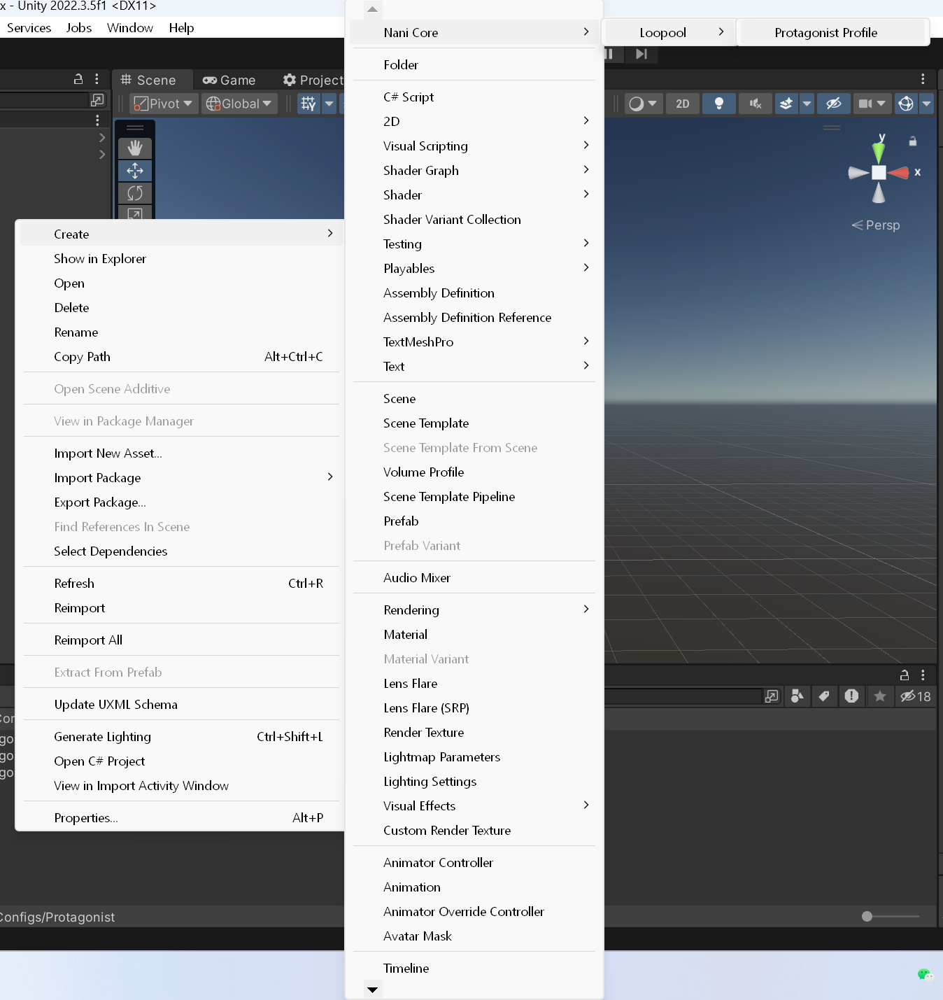
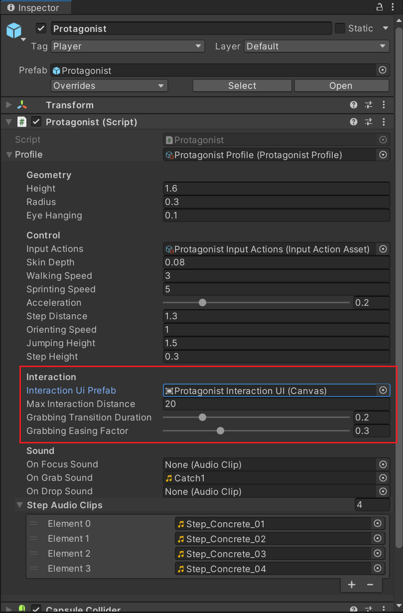

# 交互

> 已废弃。
> 请参阅[设计文档/玩家/抬头显示](
	https://github.com/nani-core/Design-Documentation/blob/master/Player.md#hud--%E6%8A%AC%E5%A4%B4%E6%98%BE%E7%A4%BA
)与[设计文档/行为/交互](
	https://github.com/nani-core/Design-Documentation/blob/master/Behaviors.md#interactions--%E4%BA%A4%E4%BA%92
)。

本篇手册介绍游戏中最基本的交互系统。

## 概述

本游戏中，玩家与世界互动的主要方式是<u>交互</u>。
交互这一行为的发出者是 [`Protagonist`](../reference/Protagonist.md)，而承载者是继承自 [Interactable](../reference/Interactable.md) 的组件。
若欲于某可交互物体交互，玩家可以通过将屏幕中心的焦点 UI（即「准星」）对准可交互物体，待到焦点 UI 切换至选中状态（从点变成圆圈），点击鼠标左键即可触发该物体的交互逻辑。

## 玩家

在交互行为的发出者，也即玩家这一方，所有的选项可在 [`Protagonist`](../reference/Protagonist.md) 的 `profile` 所引用的 `ProtagonistProfile` 实例里配置。

要新建实例，在资产面板（Project panel）中调出右键菜单，选择 `Nani Core/Stencil/Protagonist Profile` 即可。

在 `Protagonist` 组件中引用该实例资产后，即可直接在检视器面板（Inspector panel）里修改其字段。
有关交互的部分如下：

关于每项字段的作用，请参见 [ProtagonistProfile#交互](../reference/ProtagonistProfile.md#交互)。

## 可交互物体

为世界物体赋予可交互属性的是 [Interactable](../reference/Interactable.md) 这个抽象类。
要实现具体的交互逻辑，需要为物体挂载一个其合适的子类组件。
*此组件必须挂在具有碰撞体积的 `GameObject` 上*，因为它依赖于 `OnCollisionEnter/Exit` 事件工作。

共有四种子类，分别对应不同的功能：

- [Clickable](../reference/Clickable.md)：最基础的交互模式，使物体在交互时执行指定逻辑。

- [Grabbable](../reference/Grabbable.md)：使物体可被抓起、放下。

	- 抓取时可以按右键旋转抓取的物体，左键放下。
	- 当主角的视线与被抓取物体之间受到阻隔、或被抓取物体撞到其他刚体时，会自动放下。

- [Detachable](../reference/Detachable.md)：使物体在交互时获得物理效果。

	- 此组件允许在获得物理效果时对物体施加一个冲量，以实现「点击倒下」的效果。
	- 当物体同时具有 `Grabbable` 和 `Detachable` 时，总是先触发 `Detachable`；再次点击才触发 `Grabbable`。

- Switchable（未实现）：使物体可以在若干状态间以指定的方式切换。