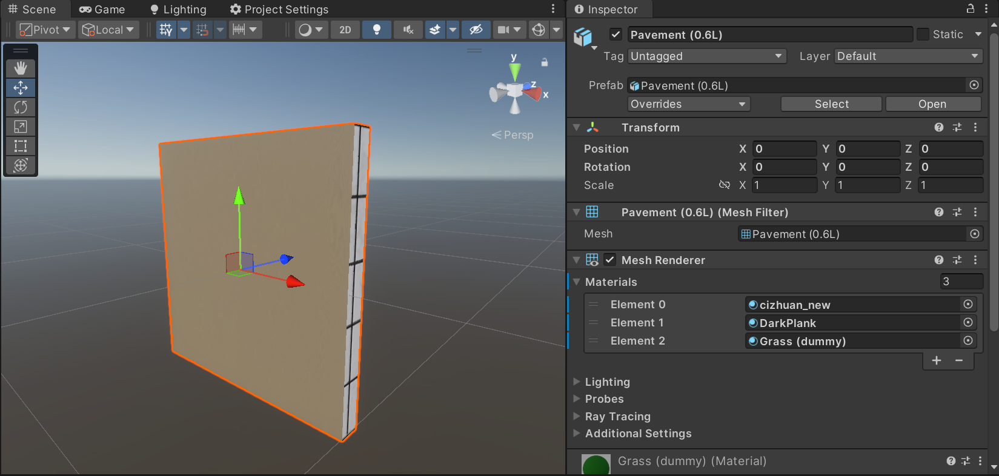

# 建模

本篇手册讲解制作三维资产时需要注意的与开发有关的事项。

本文中涉及到的内容应当通用于各种游戏项目，尽管具体的术语可能会随使用的平台而变化。
本文采用基于 Blender 和 Unity 的设定来叙述。

## Unity 端基本概念

没有接触过开发工作的三维美术很难对三维资产在游戏引擎内的使用形式有正确理解。
下面首先来了解一下 Unity 中的必须的基本概念。

### `GameObject`

`GameObject`（后面简称「GO」）是可以放在游戏场景里的“东西”的基本单位。
一个纯粹的 GO 是很简单的，没有任何形态或功能，只有它在场景里的**变换**（transform）。

> 场景里的空 GO，只有 transform。

在图中右边的 inspector（检视器）面板里可以看到「Add Component」（添加组件）的按钮。
Unity 是一门注重组合的引擎。
要想给 GO 赋予任何“特性”，需要在其上附加**组件**（component）。

总地来说，虽然一个 GO 可以附加多种组件，但若想实现多个同种组件的功能（比如渲染多个模型、拥有多个碰撞体），则必须分配到不同的 GO 上去。
本项目里经常会有“逻辑上同一个物体的岛和环可拆卸”的情况，便必须要分成不同的模型了。

在本篇手册里，我们只关心三维模型的渲染部分。
与此相关的有 `MeshRenderer`（模型渲染器） 和 `MeshFilter`（模型过滤器）两种组件。
后者允许开发者选择想要的模型，并将其传递给渲染器，使得前者发挥其功能。
我们在 GO 上添加这两个组件，并选择一个示例模型。

同样是在右边的 inspector 中我们可以看到，`MeshFilter` 中选择了兔子的模型，`MeshRenderer` 里选择了防滑铁板的材质。
这也就是说，我们可以指定模型的显示材质；模型与材质并不是强绑定的。

### `Mesh`

要想把三维资产显示在 Unity 引擎里，必须得有对应的能够放到 `MeshFilter` 里的“东西”。
这个“东西”是 Unity 在程序层面提供的储存三维模型数据的容器，称为 `Mesh`。
但，计算机科学里没有魔法，不可能随便拿来一个模型文件就说它是一个 `Mesh`，中间肯定需要一些处理步骤。
Unity 通过所谓的 importer（导入器）来做到这一点。

当 Unity 检测到资产文件夹（`/Assets/`）里有可识别的模型文件时，它就会运行 importer，自动将模型文件转化成引擎内可用的 `Mesh`。
如上图，`Stanford Bunny.blend` 经过 importer 的转化，拥有了一个从属的兔子 `Mesh`。
我们可以选中它，在 inspector 中检视导入后的 `Mesh` 的属性，如顶点数等。

但如果选中未经 importer 处理的源文件，我们还能看到更详细的导入设置。
在这里可以调整诸如是否导入相机/光源、是否转化单位尺寸、是否转化坐标轴等选项。

**特别地，导入过的模型文件也可以直接拖进场景中，成为一个预制的 GO（prefab）。**

### `Material`

`Material` 便是用来指定模型渲染出来的样貌的材质。
在 Unity 里，`Material` 必须要有自己的“模型”，也就是技术美术口中的「shader」。
它决定了一个 `Material` 有哪些“功能”，也就是在 inspector 里能够看到的那些可调整的选项。

> 一个 `Material` 的 inspector 界面。
> 最上边的 `HDRP/Lit` 是它的 shader。

仔细观察前面的 `MeshRenderer` 的 inspector 界面，会发现其 `Material` 的选择部分是一个列表。

肯定不可能无缘无故地设个列表的。
为什么一个 `Mesh` 可能要用多个 `Material` 来渲染？
这是因为一个 `Mesh` 里可以包含多个 submesh，每个 submesh 对应模型中一块*逻辑上*独立的部分。

> **注意：submesh 只对渲染有影响，对于物理等其他功能完全不透明。**
> **因此即使分了 submesh 也不能让模型分离。**

例如这块路砖的模型，它有三个 submesh，分别对应正面、侧面与背面。
通过赋予不同的 `Material`，我们可以让三个部分的显示效果不同。

**合理地分离 submesh 是创作*可复用*的三维资产的重点。**
例如要更换一扇门的把手的材质，如果不分离 submesh 的话，则需要在建模软件中替换好材质，烘焙成模型特定的贴图，再更新到 `Material` 里；
如果分离 submesh 的话，只需要将对应门把手的 `Material` 替换成想要的通用材质即可。
这样做，**不仅可以将模型与材质单方面解耦，还可以将材质与模型也解耦。**
对于任何想要的材质，只需要制作一个通用的 `Material` 即可到处使用。

## Blender 端操作

有了 Unity 端的前置知识，就可以来看如何在 Blender 里实现它们了。

### 分 object（对应 `GameObject`）

这是一个三角提示牌的 Blender 工程。
为了实现岛与环的分离，将边框与中心分成了两个 object，可见于右上角的场景管理面板。

**在 Unity 里可以直接将 Blender 里的不同 object 导入成多个 `GameObject`，因此无需再手动导出多个模型文件。**

### 分材质（对应 submesh）

肉眼可见地，这个模型有不只一个材质。
分材质的地方在左下角的细节面板里。
打开材质选项卡，可以看到类似 `MeshRenderer` 里的材质列表。

> 当然，默认情况只会有一个，你可以点击右边的加号来增加更多材质槽。
> 新创建的材质槽是空的，需要再创建材质来填充，或者选择已有的材质。

不同材质槽对应的模型面片会被导入成不同的 submesh。

要为模型分材质，进入编辑模式选择面片，然后点击「Assign」按钮。

这里分的材质具体长什么样不重要，反正不会导入到 Unity 里。
重要的是能让建模者区分出来是不同材质槽即可。

## 布 UV

前面提到，分 submesh 可以免去烘焙材质的困扰，实现材质与模型间的解耦；
但分 submesh 并不是唯一的先决条件，还得把 UV 布好。

你看，烘焙的其中一个目的是解决“把正确的材质贴到正确的地方去”这个问题。
显然一个通用的材质是不知道模型哪是哪的。
因此要适配通用材质，我们得保证模型自己的 UV 在通用材质上的行为正确。

这里其实有两种不同的情况要考虑，我们分别介绍。

### 画布空间

最简单的一种情况，“这个模型是要显示一幅画的”。
模型的形态如何、大小多大，一律不关心，只需要让画对齐边缘即可。
比如三角立牌的内部正面即是用来显示立牌画面的。
作为立牌画面的材质本身就构成了 UV 空间，所以我们应当在保持方向的同时让面片尽可能大地平铺在 UV 空间里。

墙上的挂画、方形提示牌等同理。

当然，如果需求要求只显示画布的一部分，UV 也应当跟着调整。

### 几何空间

当然不是所有模型都用来显示画布。
事实上，绝大多数三维模型的表面都是要显示某种“具体”材质的，例如木纹、铁皮等。
这种材质天生具有尺度和方向的概念。
为了适配这类通用材质，我们要求面片的 UV 必须与其几何形状、大小以及方向相配合。

如果形状不同，显示效果就会显得扭曲拉伸；
如果大小不同，显示效果就会尺度不一；
如果方向不同，显示效果就会显得纹理与走势不合。

这里的「形状」「方向」仅仅是指局部上的。
例如一根吸管，其实际几何形状可能会扭得乱七八糟，但管壁上的每一个四边形在逻辑上都应当是平直的，对应 UV 空间里的轴对齐的矩形。

「大小」的要求正相反，不但要求模型内部各面片的相对尺度正确，还要考虑到放到世界里的大小。
这是因为，通用材质的尺度是固定的。
如果模型的 UV 只考虑自己而不考虑世界，就有可能出现“这个模型上的纹理比那个模型上的纹理更密集/稀疏”的情况。

如图是三角牌边框所有面片的 UV 展开，虽然它们在实际空间里并不平行，但是逻辑上的纹路走势是一致的，因此反映在 UV 空间里都是方向相同的矩形。
另外，这个三角牌的边长正好是 1m，因此这些矩形的高便是 1，不需要额外缩放。

> 视目标材质的贴图语义而定。
> 如果目标贴图的一整个跨度对应 2m，那这里的所有 UV 就要缩小一半。