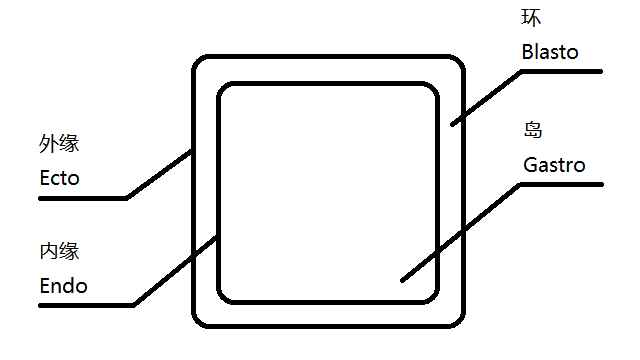

# 光学回形

> 已废弃。

> 请参阅[设计文档/回形图案#光学回形](
	https://github.com/nani-core/Design-Documentation/blob/master/Pattern.md#optical-patterns--%E5%85%89%E5%AD%A6%E5%9B%9E%E5%BD%A2
)。

本篇手册介绍本游戏里最高级的机制——光学回形（Optical Loopshape）。

光学回形是指那些*本来没有关系，但是在特定透视下看上去正好可以凑成回形图案*的物体对。
如下图是一个正好满足的方形光学回形。

根据设计文档的描述，光学回形由<u>环</u>（blasto）和<u>岛</u>（gastro）构成

要在场景中添加一组光学回形的机会，请使用 [`OpticalLoopShape`](../reference/OpticalLoopShape.md) 组件。
在检视器面板（Inspector panel）中指定希望的环与岛物体，然后设置预期的宽度与容差（单位为游戏画面高度的百分比）即可。
该组件会在两物体在屏幕上的形状符合容差时自动触发回形图案的满足逻辑。

回形图案被满足时，屏幕上的焦点 UI 将会切换为「可交互」状态（一个圆圈）。
此时按下左键，即使有别的可交互对象，也会优先触发回形图案的开启事件。

`OpticalLoopShape` 提供这些公有实例方法：

- `void Stamp()`：将屏幕画面投射到环的材质上去，并使之称为 unlit 的。
- `void DestroyGastro()`：销毁（实是禁用）岛物体。

搭配使用，可以实现「开启回形图案时岛被印在环上」的效果（如下图）。

