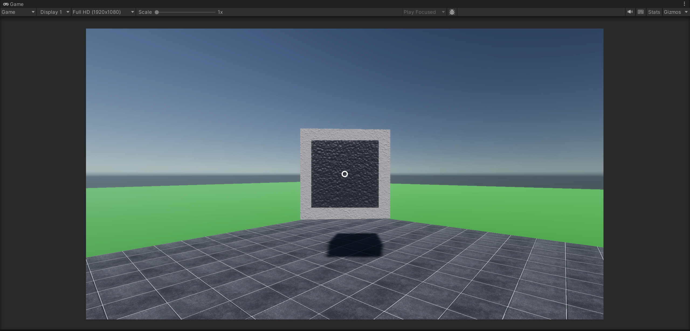
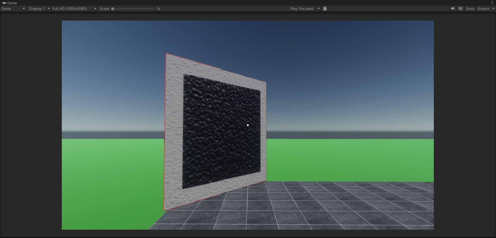

# OpticalLoopShape

> 请参阅[手册/光学回形](../manual/optical-loopshape.md)。

`OpticalLoopShape` 是光学回形的控制器类。

光学回形在「环」（blasto）和「岛」（gastro）的 `GameObject` 在屏幕上的遮挡关系正好构成近似固定宽度的窄带时被满足。
如下图为一个满足了的光学回形。

- 继承自：[`LoopShape`](LoopShape.md)

## 序列化属性

- `GameObject blasto`：环。
- `GameObject gastro`：岛。
- `float thickness`：预期的窄带宽度占游戏屏幕高度的比例。
- `float thicknessTolerance`：实际窄带宽度的容错。

	例如 `thickness` = 0.05、`thicknessTolerance` = 0.01、屏幕高度 = 720px 的配置允许回形由宽度落在 720px*\[0.04, 0.06\] = \[29px, 43px\] 之间的窄带满足。

- `bool showDebugLayer`：（仅 editor）显示调试图层。

	> 此字段目前失效。

- `float debugLayerOpacity`：（仅 editor）调试图层的透明度。

## 方法

- `void DestroyGastro()`：销毁岛。

- `void Stamp()`：投射环。

	如下图为一个投射过的光学回形（岛已销毁）。

	